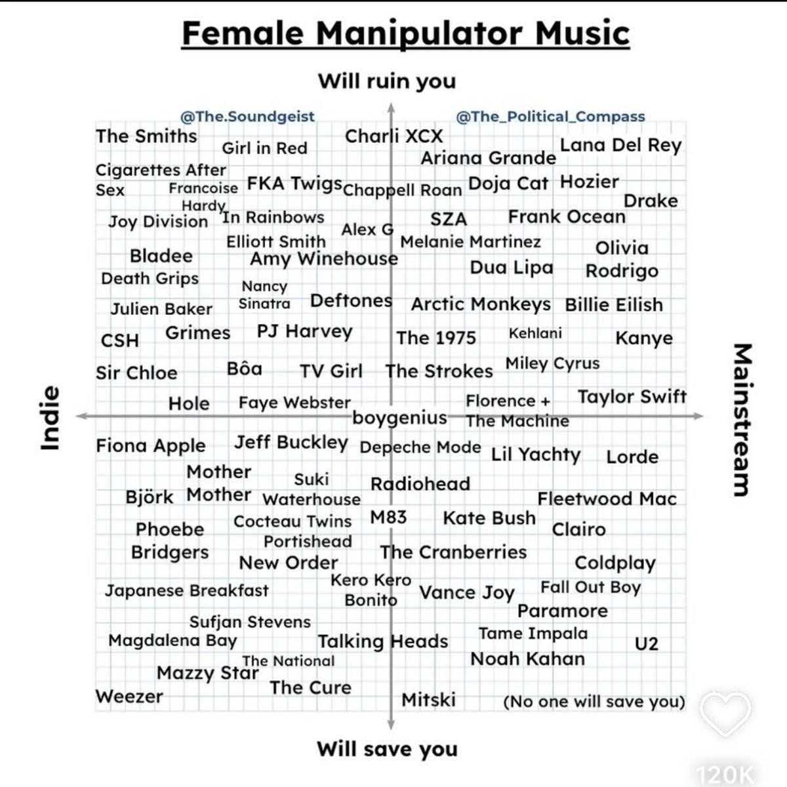
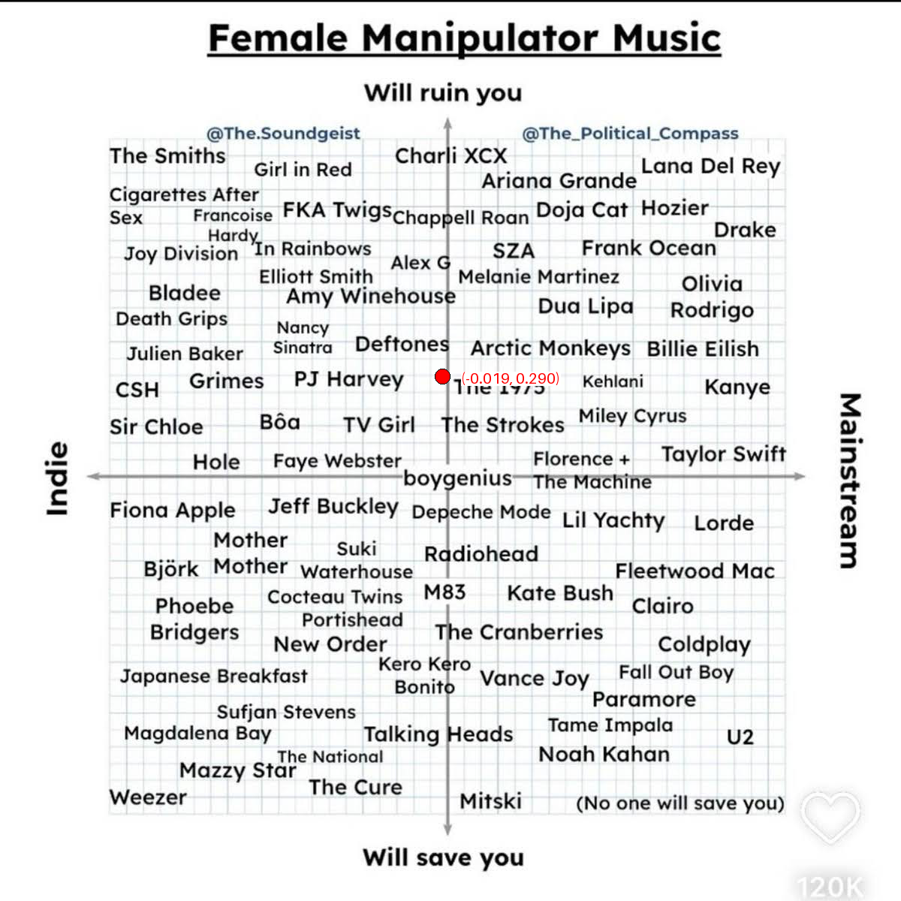

# Female Manipulator Musical Alignment Compass

We have all wanted to know what kind of female manipulator we are according to our music taste. This repository uses the following rigorously researched quadrant system to pinpoint your manipulative tendencies according to your indie vs. mainstream tendencies (X axis) and your propensity to be ruinous vs. virtuous (Y axis). 




## Steps to Use

1. Go to https://www.spotify.com/ca-en/account/privacy/
2. Request and download your extended streaming history (this should arrive in less than a week)
3. Activate your conda base environment, or create a Python venv and run `pip install pandas pillow`
4. Run the following command:
```
python main.py --folder_path_to_jsons <PATH>
               [--start_date <YYYYMMDD>]
               [--end_date <YYYYMMDD>]
```

Example:
```
python main.py --folder_path_to_jsons "Spotify Extended Streaming History" --start_date 20230101 --end_date 20241231
```

## Outputs
A number of items will be printed in the terminal, including:
- The total number of songs you have listened to (defined as songs in your listening history where `Skipped=False`) in the specified date range
- The total number of female manipulator songs you have listened to (defined as non-skipped songs primarily attributed to an arist present in this compass)
- The number of times you have listened to each of these artists in the specified date range
- Your coordinates on the compass (calculated as the coordinate average of each of the artists, weighted by play count)
- The number of times you have listened to artists in each of the quadrants

Running the script will also save:
- `compass_with_dot.png` - your listening coordinates plotted on the original compass image so you can share with your friends. Example output:


- `artist_frequencies.csv` - the counts of all arists (female manipulator and non-female manipulator) calculated over the specified date range. 

---

 Vibecoded with ❤️